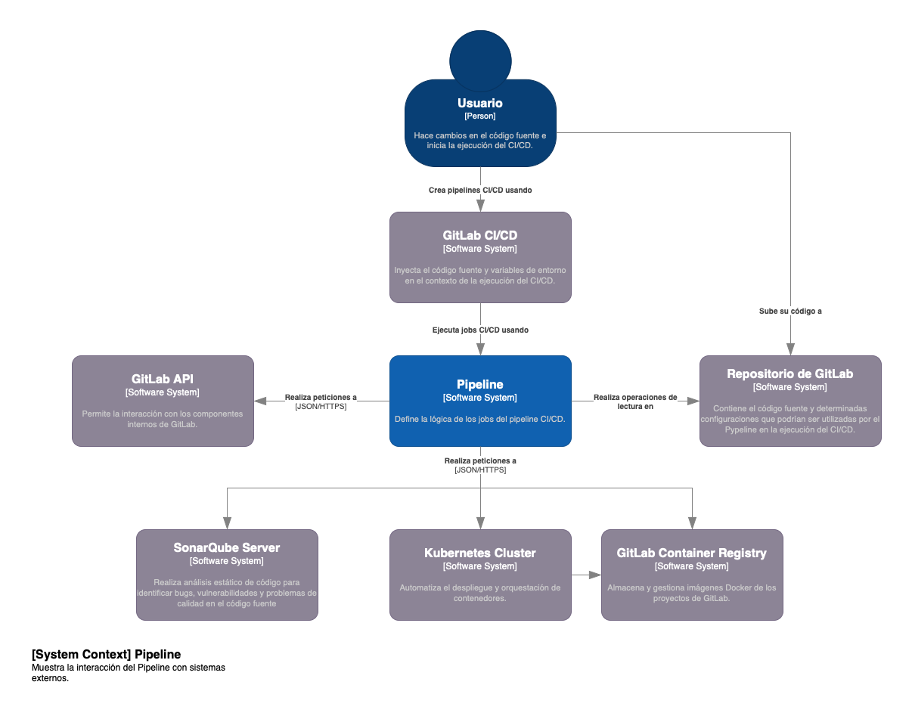
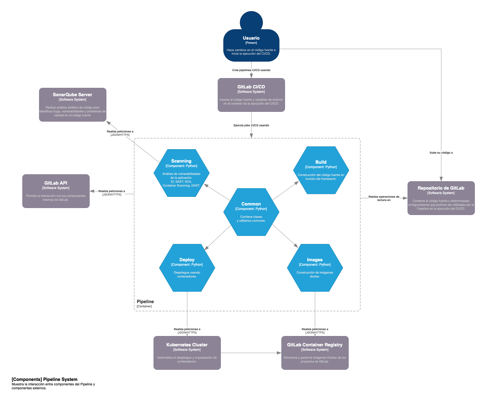

# Pipeline
Este proyecto contiene un pipeline diseñado para automatizar procesos con un alto nivel de abstracción, lo que permite adaptarse a varios frameworks. Está diseñado para funcionar con GitLab CI/CD, proporcionando una integración fluida y eficiente para la automatización de tareas dentro de este entorno.

## Estructura del Proyecto

- **pipeline/**: Contiene los archivos relacionados con la configuración del pipeline.

La arquitectura y diseño del pipeline se realizó siguiendo el modelo C4, que permite representar diferentes niveles de abstracción de un sistema de software.

### Diagrama de Contexto del Sistema



### Diagrama de Componentes



## Cómo descargar el proyecto en ambiente de desarrollo

Para comenzar a trabajar con este proyecto, sigue estos pasos:

1. Clona el repositorio utilizando el siguiente comando:

    ```bash
    git clone <URL_DEL_REPOSITORIO>
    ```

2. Luego, sincroniza y configura el proyecto con el siguiente comando:

    ```bash
    uv sync
    ```

## Uso en Ambientes de Producción

Para los ambientes de producción, se dispone de la imagen docker `emilioflc/pipeline`, la cual puede ser utilizada con los GitLab Runner que empleen el Docker executor. Esto permite ejecutar cualquier job configurando la variable de entorno `JOB_IDENTIFIER` y con el siguiente comando:

```bash
python -m pipeline
```
